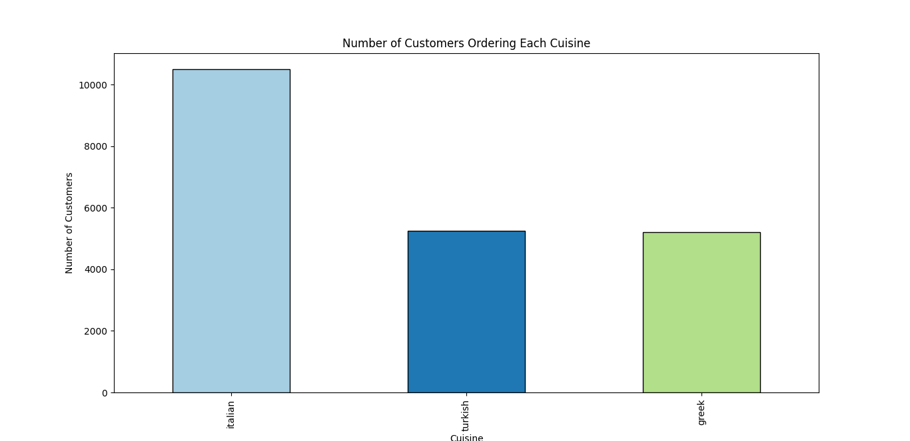
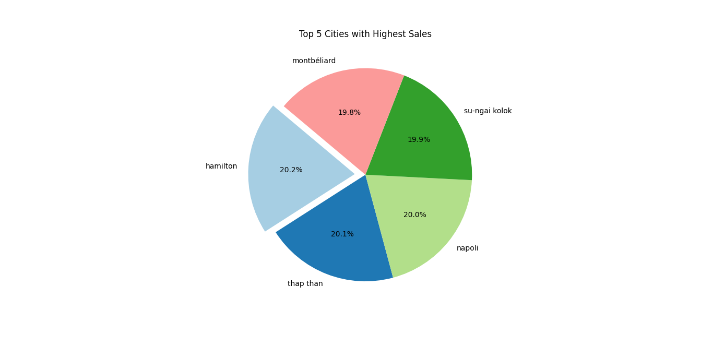
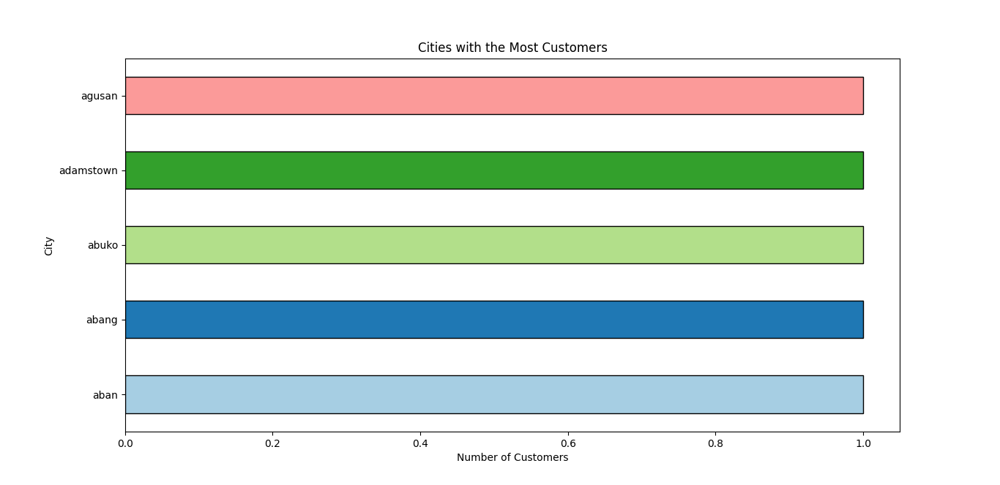

# LITTLE LEMON REPORT
*Prepared By:  Tumisang Tshimologo* 

*Date: 16/01/2024*

## PROJECT OVERVIEW
### Title
- Little Lemon's Sales Expansion Project

### Objectives
#### 1. Customer loyalty analysis
- How many loyal customers are there?
- Where are the loyal customers located?
#### 2. Menu analysis
- Which cuisine has the highest sales?
- How are the meals arranged based on the number of purchases, from most to least?
- Which cuisine has the lowest sales?
#### 3. Sales analysis
- Which cuisine generates higher revenue?
#### 4. Geographical analysis
- Which area has the most loyal customers, and which has the least?
- How many customers does the restaurant have per location?

## BACKGROUND 
### Problem Study 
Little Lemon aspires to open another branch; however, before proceeding with this expansion project, they must first identify strategies to increase their sales and pinpoint the locations where most of their loyal customers reside. As a data analyst, your task is to utilize the available data to assist Little Lemon in making informed, data-driven decisions for the successful planning of their new branch.

### Context
Little Lemon Restaurant, a whimsical and vibrant culinary gem, was founded in 1985 by Chef Olivia Meyer. Infused with Chef Olivia's passion for citrus flavors, the restaurant offers a unique dining experience with a diverse menu that seamlessly blends international cuisines. The walls adorned with lemon-themed artwork and tables featuring lemon-inspired centerpieces add to the restaurant's charm. Little Lemon takes pride in sourcing fresh ingredients, particularly locally grown lemons, to craft dishes that consistently surprise and delight patrons. Over the years, it has become a beloved destination, renowned for its warm staff, accommodating menu, and unforgettable dining experiences. Chef Olivia's dedication to culinary excellence has earned the restaurant numerous accolades, solidifying its status as a culinary institution.

## DATA PREPROCESSING
### Data Collection
The dataset was acquired from the Google Coursera Data Analytics study materials.
### Data Description
The following code snippet was executed to load the dataframe into the program.
```py 
dataframe = pd.read_csv('C:/Users/cse20-054/Documents/My Projects/DataAnalysis/Python/Little Lemon Project/Little Lemon.csv')
```

The code snippet below was used to describe the data provided.
```py 
# DATA DESCRPTION
print('DATA INFORMATION: ', dataframe.info())
print('DATA DESCPRITION: ', dataframe.describe())
print('DATA SHAPE: ', dataframe.shape)
```
The provided dataset consisted of 21,000 entries and comprises 21 columns. The column names and the types of data contained in each column are as follows:

- Row number: Natural numbers
- Order ID: Letters
- Order Date: Letters
- Delivery Date: Letters
- Customer ID: Letters
- Customer Name: Letters
- City: Letters
- Country: Letters
- Postal Code: Letters
- Country Code: Letters
- Cost: Decimal numbers
- Sales: Decimal numbers
- Quantity: Natural numbers
- Discount: Decimal numbers
- Delivery Cost: Decimal numbers
- Course Name: Letters
- Cuisine Name: Letters
- Starter Name: Letters
- Dessert Name: Letters
- Drinks: Letters
- Sides: Letters.

### Data Cleaning
```py
# DATA CLEANING
no_null_dataframe = dataframe.dropna(axis=0)
print('Null values dropped!')

no_repeating_dataset = no_null_dataframe.drop_duplicates()
print('Duplicates dropped!')

no_repeating_dataset_lower = no_repeating_dataset.applymap(lambda x: x.lower() if isinstance(x, str) else x)
print('String values converted to lower case!')

columns_to_drop = ['Row Number', 'Order ID', 'Delivery Date', 'Customer Name', 'Country', 'Postal Code', 'Country Code', 'Delivery Cost']
no_repeating_dataset_lower.drop(columns=columns_to_drop) # Drop the specified columns
print('Unused columns dropped!')

my_dataframe = no_repeating_dataset_lower
```

As shown in the above provided code snipper null and repeated entries were removed, and text was converted to lowercase. After cleaning, the dataset consisted of 20,999 entries and 13 vital columns. 

## EXPLORATORY DATA ANALYSIS (EDA)
### Key Statistics
```py
# 1. SALES
# Descriptive Statistics
stats = my_dataframe['Sales'].describe()

# Additional Statistics
mean = my_dataframe['Sales'].mean()
median = my_dataframe['Sales'].median()
mode = my_dataframe['Sales'].mode().iloc[0]
std_dev = my_dataframe['Sales'].std()
quartiles = my_dataframe['Sales'].quantile([0.25, 0.5, 0.75])
```
The code snippet provided above was executed to obtain sales statistics. Sales have the following statistics:
- Mean: 220.55
- Median: 220.55
- Mode: 66.86
- Standard Deviation: 114.81
- Min: 66.86
- Max: 480
- Count: 20,958
- Quartiles: 25% - 137.76, 50% - 186.93, 75% - 315.0

```py
unique_customer_ids = my_dataframe['Customer ID'].nunique()
unique_cities = my_dataframe['City'].nunique()
unique_courses = my_dataframe['Cuisine Name'].nunique()
```
Additionally, Little Lemon has 998 customers in 973 cities, ordering from three cuisines and the above code snippet was utilized to obtain these values.

### Visualization
#### 1. Customers ordering each cuisine

As illustrated in the above bar graph, Little Lemon offers three cuisines: Italian, Turkish, and Greek. Among these cuisines, Italian is the most preferred by clients, with 10,000 customers ordering it. Turkish and Greek are the second most preferred, each having a total of 5,000 customers ordering them, respectively.

#### 2. Cities with the highest sales

The pie chart above indicates the top five cities with the highest sales. Montbéliard has the least share in the list, accounting for 19.8% of total sales. The fourth city with the highest total sales is Su-ngai Kolok, contributing 19.9% to the total sales. Napoli follows with a total sales percentage of 20%. Thap Than secures the second-highest sales at 20.1%, while Hamilton claims the top spot with 20.2% of total sales.


#### 3. Cities with the highest customer base

Above is a horizontal bar graph of the top five cities with the highest customer base, namely Aban, Abang, Abuko, Adamstown, and Agusan, all having the same number of customers.

## RESULTS AND FINDINGS
#### Main Insight
Italian cuisine brings in increased sales, while Aban, Abang, Abuko, Adamstown, and Agusan have the highest customer base. However, Hamilton and Thap Than lead in sales.
#### Actionable Insight
- Introduce new Italian recipes and food items to the menu.
-Perform recipe tests in Aban, Abang, Abuko, Adamstown, and Agusan.
- Build the new branch in either Hamilton or Thap Than
## DATA ANALYSIS TECHINQUES
#### Methods
- Data Collection
- Data Description
- Support Decision Making

#### Data Cleaning
- Drop null entries
- Drop duplicates
- Drop unused columns
- Convert text to lowercase

#### Statistical Methods
1. Descriptive Statistics:
- Mean
- Mode
- Median
- Max
- Min
- Standard Deviation
- Quartiles
- Count

#### Data Visualization
- Bar Graph
- Pie Chart
- Horizontal Bar Graph

## SKILLS DEMONSTRATED
- Statistical Knowledge
- Programming Skills:
   - Proficiency in the Python programming language. 
- Data Cleaning and Preprocessing
- Data Visualization
- Critical Thinking
- Communication Skills
- Domain Knowledge
- Tools and Software:
    - Proficiency in using Python integrated development environments (IDEs).
    - Knowledge of Github version control system. 
